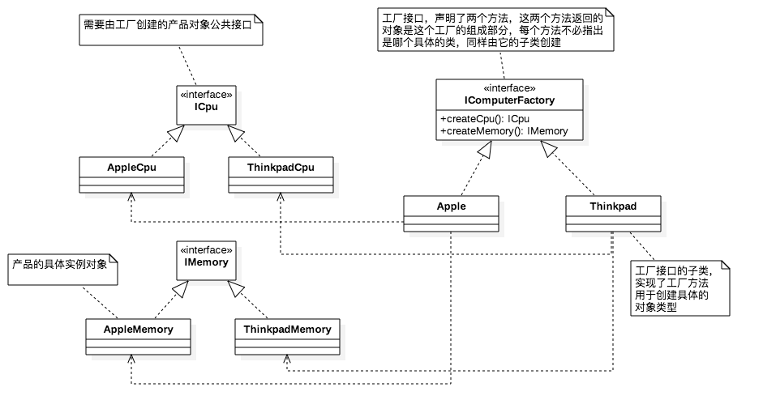
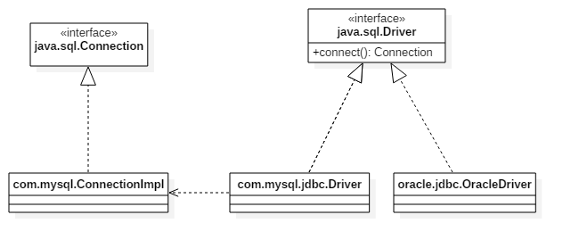

# 1.2 抽象工厂模式

## 引子

在现实生活中商品有许多品牌，每一个品牌的商品又是有许多零零散散的构建所组成。例如电脑是一个商品，它由CPU、内存等组成，同时又有华硕、苹果、联想等品牌生产电脑这种商品。

## 介绍

在工厂方法模式中一个工厂接口只会定义一个工厂方法用于创建对象实例，它的子类具体工厂负责创建具体的对象实例。在抽象工厂模式中，一个工厂接口有多个方法，这些方法返回不同的对象实例，工厂接口的具体子类工厂实现这些方法返回不同的对象实例。从代码形式上看，抽象工厂模式不过是在工厂中定义了多个方法，而工厂方法模式则只有一个。所以，工厂方法模式就是一种特殊的抽象工厂方法。

从引子中的例子就可以得出，电脑是一个工厂接口，在这个工厂接口中定义了CPU方法、内存方法等。而电脑的实现类又有华硕、苹果、联想等电脑品牌，它们生产CPU、内存的方式又不尽相同。这种情况下使用抽象工厂方法就是较好的选择。

如果对于生产一个内存条，这个产品不能再继续划分，此时用工厂方法模式就是较好的选择。

也就是说，我认为，如果一个对象中并没有其他对象的组合，只是一个单一且不依赖的对象，可以使用**工厂模式方法**，而如果一个对象中包含其他对象，相互依赖，此时则可以选择使用**抽象工厂方法**

这里还是先画出抽象工厂模式的UML类图。

<div align=center>
	
</div>

这个图看起来只是比工厂模式多了一个新的产品，工厂接口中多了一个方法而已，却又对它定义了一个新的设计模式名称。其实，这只是看到了表象，在不同的场景合理选用设计模式。UML图中“<----”引用符号可能造成了干扰，大可不必感到忧虑。这只是代表一个类引用了另外一个类而已，在工厂中`return new ConcreteProductA()`就是表示了对`ConcreteProductA`类的引用。就算省去也不会影响阅读，重点应该放在工厂接口的设计上有何不同。

所以对于引子中的“电脑”例子，我们来画出它的抽象工厂模式UML类图。

<div align=center>
	
</div>

```java
IComputerFactory factory = new Apple();
ICpu cpu = factory.createCpu();
```

如果有一个新的厂家进行对接，则这个新的厂家直接实现IComputerFactory接口，并实现ICpu、IMemory接口即可。

## Java源码中的抽象工厂模式

抽象工厂模式看似只是在工厂中新增了一个方法，但笔者认为这只是表象，它和工厂方法模式的应用场景是不一样的。

在Java源码中通过JDBC可以连接操作不同的数据库，它的设计同样是基于抽象工厂模式。严格来讲，它更属于是工厂模式，至于抽象工厂模式和工厂模式在后面会提到。

对于使用JDBC连接数据库，首先会经历下面两个阶段：加载、连接。

```java
Class.forName("com.mysql.jdbc.Driver");		//加载数据库驱动
Connection connection = DriverManager.getConnection("url", "username", "password");	//连接相应的数据库
```

DriverManager#getConnection是我们在**1.1工厂模式**一节的**Tips**中提到的静态工厂方法，它用于创建并返回一个`Connection`数据连接。在其内部调用了一个私有的`getConnection(String, java.util.Properties, Class<?>)`重载方法。在这个私有`getConnection`方法中会遍历已经注册数据库驱动，也就是我们加载的MySQL数据库驱动`Class.forName("com.mysql.jdbc.Driver")`。

```java
//private static Connection getConnection(String url, java.util.Properties info, Class<?> caller)
···
for(DriverInfo aDriver : registeredDrivers)
···
	Connection con = aDriver.driver.connect(url, info);
```

代码中`aDriver.driver`返回的正是MySQL实现的具体驱动，也就是一个具体的子工厂——`com.mysql.jdbc.Driver`，它的抽象工厂接口则是Java提供的——`com.sql.Driver`。

分析到这个地方，我们已经能画出它的UML类图了。

<div align=center>
	
</div>

实际上MySQL对于它的数据库驱动设计不止向上图这么简单，在类的继承关系上还有很多，包括它对于`java.sql.Connection`的实现也不止一个。但我们剥离出其他的设计考虑，其本质上还是一个抽象工厂模式。这个图和引子中的不同电脑品牌有了很好的呼应。因为数据库本身也不止一种，还有Oracle、SqlServer等等，Java定义了一种JDBC连接数据库的方式和相应的接口，各个厂商只需要实现它即可。客户端在选择使用哪种数据库的时候不用关心具体方法的调用或者返回哪一个类，只需要使用工厂中提供的工厂方法即可。

## Tips

有关抽象工厂模式和工厂模式（指工厂方法模式），看似只是工厂中定义多个方法返回多个对象和定义一个方法返回一个对象的区别。从代码结构上确实如此，工厂模式是抽象工厂模式也没错，只是从概念上来讲抽象工厂模式更为抽象，更为一般。而工厂模式是抽象工厂模式的特殊形式。这种概念的定义在数学中很常见，定义的概念往往有**一般地，什么什么，称之为什么定理；特殊地，什么什么，称之为什么定理。**笔者认为不必过于考究其中的概念。

如果工厂所产生的产品有多个子产品组成（例如电脑、汽车），此时可以考虑抽象工厂模式；如果工厂只生产一种不可再划分的产品（例如CPU、轮子），此时可以考虑工厂模式。

再简单点，复杂对象使用较为复杂的抽象工厂模式；简单对象使用较为简单的工厂模式。