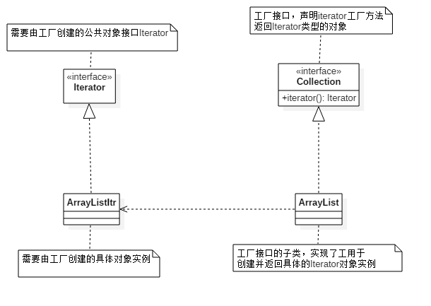

# 1.1 工厂模式

## 引子

工厂，是用于生产商品的地方。现实生活中，一个人并不会自己生产铅笔、钢笔、毛笔，它会直接选择从工厂生产出来商品。

在面向对象的世界里，我们习惯于将各种事物进行抽象，将各种各样的对象进行组合以便实现我们的业务逻辑。而在组合过程中，我们需要自己来创建对象，**工厂模式定义一个用于创建对象的接口，让子类决定实例化哪一个**。这也是它是创建型设计模式的原因，用于创建对象。

## 介绍

对于工厂方法，首先是需要定义一个用于产生具体对象的工厂接口，其次还有一个具体对象的公共父接口、抽象类。产生具体对象是工厂接口的子类，注意是工厂接口的子类。接下来先用UML类图来直观感受下工厂模式。 

<div align="center">
	
</div>

在不了解工厂模式的情况下看到这个UML几乎是处于茫然状态，下面从不借助工厂模式到借助工厂模式的代码演进进行了解。

**阶段1——强耦合，结构化**

```java
ConcreteProduct product = new ConcreteProduct();
```
在这个阶段并没有理解到面向对象编程的含义，代码的编写还是沿用结构化编程的方式，如果此时有另一个具体对象，则继续是单独写一个类而不会对两个类进行抽象。

```java
ConcreteProduct product = new ConcreteProduct();
ConcreteProduct2 product2 = new ConcreteProduct2();
```
**阶段2——强耦合，OOP**

此时会对两个具体的产品的公共部分进行抽象为一个接口——Product。代码的编写演变到如下所示。

```java
Product product = new ConcreteProduct();
```
进行到这一阶段，你已经知道了面向对象的抽象威力，这能使你省去大量代码。

**阶段3——松耦合，OOP**

上一个阶段我们利用了OOP的思想，但还是未能消除**强耦合**带来的问题，尽管直接new一个对象是很常见的一个动作，但在现如今的编码中，将控制权交由第三方来控制（IoC）能让代码耦合度更低，高内聚低耦合是软件编码过程中的黄金定律，耦合度更低的代码具有复用性更强，更容易测试，扩展性更好的特点。

```java
Product product = Factory.createProduct('concreteProduct');
```
在这段代码中使用的实际上是**简单工厂模式**，这和**工厂方法模式**有细微的区别，这里通过传入一个参数创建一个特定的实例对象（ConcreteProduct），这就是一种IoC思想——将创建对象（ConcreteProduct）的控制权交给了第三方（Factory），从而实现了对代码的解耦。

```java
/**
 * 简单工厂模式
 * Created by Kevin.
 */
public class Factory {
    public static Product createProduct(String product) {
        switch (product) {
            case "concreteProduct":
                return new ConcreteProduct();
            case "concreteProduct2":
                return new ConcreteProduct2();
            default:
                return null;
        }
    } 
}
```
进行到这一步，我们代码已经改造得近乎完美，看似解决了耦合性问题，又利用OOP的思想。工厂模式似乎还并未派上用场，接下来问题马上就来。

此时，我们因为一个新的需求需要再创建一个新的Product实现类，首先当然我们能直接实现Product类——ConcreteProduct3，由于OOP的思想我们能直接复用。接下来要创建一个ConcreteProduct3对象，**我们需要在原有的工厂类增加一个case判断语句**。

```java
/**
 * 简单工厂模式，新增case判断语句
 * Created by Kevin.
 */
public class Factory {
    public static Product createProduct(String product) {
        switch (product) {
            case "concreteProduct":
                return new ConcreteProduct();
            case "concreteProduct2":
                return new ConcreteProduct2();
            case "concreteProcduct3":
                return new ConcreteProduct3();
            default:
                return null;
        }
    }
}
```
再将传入方法的参数修改为"concreteProduct3"就能获取ConcreteProduct3实例对象。

注意上面的关键——需要在原有的工厂类上**修改代码**，代码扩展性的体现并不是修改原有代码来新增功能，而是新增代码就能扩展一个新功能。显然，上面的简单工厂模式没有满足这一点要求，因为它**动**了原有代码。

这个时候就该本文的主题工厂模式登场了。

工厂模式也有一个公共的工厂接口提供一个创建对象的工厂方法。

```java
/**
 * 工厂模式，工厂接口
 * Created by Kevin.
 */
public interface IFactory {
    Product createProduct();
}
```

此时并没有唯一的工厂类，而是需要创建各个具体对象示例相应的工厂，例如ConcreteProductFactory。

```java
/**
 * 工厂模式，具体工厂类
 * Created by Kevin.
 */
public class ConcreteProductFactory {
    public Product createProduct() {
        new ConcreteProduct();
    }
}
```
最初的`Product product = new ConcreteProduct()`就演变成了如下代码。

```java
IFactory factory = new ConcreteProductFactory();
Product product = factory.createProduct();
```

同样现在新增了一个具体对象，此时我们不必修改原有代码，只需要实现一个ConcreteProduct3Factory工厂类返回ConcreteProduct实例对象即可。这是工厂模式和简单工厂模式最大的区别——不必在原有代码上进行修改，而是通过新增的方法扩展新的功能。

讲到这里，或许你有一个疑问在阶段2的时候你说直接new一个对象这会造成强耦合，所以在阶段3使用了IoC思想将创建对象的控制权交给了第三方，但是到最后的工厂模式`IFactory factory = new ConcreteProductFactory()`不也直接new了一个工厂实例对象吗？这不也产生了强耦合吗？这和直接`new ConcreateProduct()`到底有什么好处呢？并且好像只看到了代码的复杂度增高了，实际上也并未消除强耦合。

这里实际上产生了一种错觉，这个例子没有实际业务场景无法体会工厂设计模式所带来的优越感，当然它有缺点，它的缺点就是代码复杂度增加了，并且需要和具体类所对应的工厂强耦合。

之所以造成一种错觉工厂设计模式不如直接new来得快，来得爽，正是因为这里所有的代码都是你一人写的，然而在实际开发过程中情况更为复杂并且通常是多人合作，多人合作提供给对方的往往是一个接口。也许Product接口是你写的，而具体实现类ConcreteProduct则是由他人写的，此时在其他人没有完成代码编写时你无法对它创建实例对象，然而利用工厂模式他人却能给你提供一个工厂返回一个接口。

在实际编码中，往往来得快来得爽的代码大多都会埋下未知的隐患。

## Java源码中的工厂模式

在Java源码中Iterator迭代器的实例对象创建使用的就是工厂模式，所以这里举例Iterator探寻JDK作者们是如何将工厂模式应用到Java源码中的。

由于Java源码的多样性和复杂性，有的看起来并不那么像一个“标准”的设计模式，所以笔者在这里会对一些类进行简化，例如省去泛型，或将类的继承关系简化，或在分析源码结构时先将内部类剥离出来等等。

先来一段创建Iterator迭代器的代码。

```java
//创建Iterator迭代器
Collection collection = new ArrayList();
Iterator iterator = collection.iterator();
//工厂模式
IFactory factory = new ConcreteFactory();
Product product = factory.createProduct();
```
这和介绍中的工厂模式如出一辙（尽管实际上我们可能并不会这么写，`List list = new ArrayList()`的方式更常用）。

所以我们能依葫芦画瓢照着工厂模式的UML类图画出Iterator工厂模式的类图。

<div align=center>
    
</div>

事实上在Java源码中并没有一个叫ArrayListItr的实现类，Iterator的实现类在ArrayList内部，也就是说在ArrayList有一个内部类。如果我们将Iterator的实现类单独定义，代码的包结构如下所示。
```
factory
├── Collection
├── ArrayList
│
product
├── Iterator 
└── ArrayListItr
```
Java源码则将ArrayListItr在ArrayList内部，包结构如下所示。
```
java.util
├── Collection
├── ArrayList
└── Iterator
```
将它们全部放在java.util下是因为还有其他功能的实现需要这么做。不单独实现Iterator从代码结构上来讲能更加清晰，把Product的具体实现放到具体工厂中作为一个内部类是一种很好的设计思路。

## 拓展

工厂模式在很多开源框架中都有使用，因为它给程序带来了较大的扩展性。例如在Spring框架中c创建bean对象的过程就是使用了工厂模式的一种——简单工厂模式，这在上面有提过，通过传递一个参数返回应对的实例对象，不过在Spring中当然不是switch-case判断，而是使用了反射来创建对象实例。

```java
    ApplicationContext application = new ClassPathXmlApplicationContext("applicationContext.xml");
    Product product = (ConcreteProduct) application.getBean("concreteProduct");
```

<div align=center>
    
</div>

Spring的源码很复杂各种类继承引用，这里就不再深入了解，有兴趣的可以查阅Spring源码找寻其中的设计模式。

## Tips

关于工厂模式有几个比较模糊的概念：**工厂方法模式**、**简单工厂模式**、**抽象工厂模式**、**静态工厂方法**。

本文所述**工厂模式**指的是**工厂方法模式**。**简单工厂模式**并未列入23种设计模式之中，它与**工厂方法模式**的区别上文已做解释。有关**抽象工厂模式**会在下一节介绍。

需要注意的是——**静态工厂方法**。

静态工厂方法在*《Effective Java》*中的开篇就大力推崇，它和工厂模式的目的都是创建实例对象。对于静态工厂方法，通常类的自身提供一个静态方法用于实例化（当然也可以是一个工具类例如`Collections`），从而避免使用构造器。例如Java源码中的Boolean包装类。

```java
public static Boolean valueOf(boolean b) {
    return (b ? TRUE : FALSE);
}
```
Boolean自身就提供了一个工厂方法用于返回一个Boolean对象。

对应到前面提到的创建一个具体产品的例子，如果ConcreteProduct提供了一个静态工厂方法，则变为以下形态。

```java
Product product = ConcreteProduct.getInstance();
```
这是一个类自身提供了一个静态方法用于对自身的实例化，它取代了new构造器的方式，而这是与工厂模式利用第三方类来创建对象的不同。取代构造器创建对象实例可以有几个好处：

* **可以自由的对方法进行命名。**命名是门学问，命的好事半功倍，命得差真的要跪。而构造器没法进行命名。

* **不必每次都创建一个对象。**这实际上就是熟悉的单例模式了，每次获取对象实例的时候都是同一个。

静态工厂方法并不一定都是由类的自身提供，还有可能是工具类，例如`Collections`。

Collections类中另外还实现了几十种集合供我们使用，但这些集合都不能通过直接new的方式获取，而是在Collections的内部提供了静态工厂方法，不能直接实例化大大减少了API的数量，如果几十种集合全部能直接实例化，各种API各种概念都是庞大的工作量，而使用静态工厂方法通过命名则很好的解决了这一个痛点。

```java
Collections.synchronizedMap(new HashMap<>());
Collections.synchronizedList(new ArrayList<>());
Collections.unmodifiableMap(new HashMap<>());
Collections.unmodifiableList(new ArrayList<>());
······
```

Collections通过静态工厂方法导出集合方式不仅仅在于API数量的减小，这就是静态工厂方法的第三个有点：

* **它能返回原有返回类型的子类型。**

以`Collections.synchronizedList`举例，其内部方法返回的是List类型，而它的真正子类型则是`SynchronizedList`，这在其Collections作为内部类实现。这样我们不必暴露出SynchronizedList，也就是隐藏了我们真正实现的类，但又可以返回真正的对象，这个意义所在就是实现了基于接口编程。
